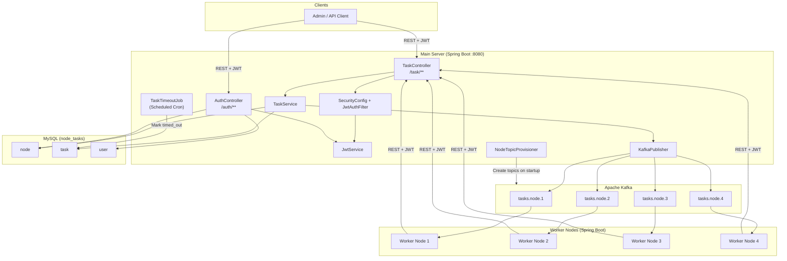
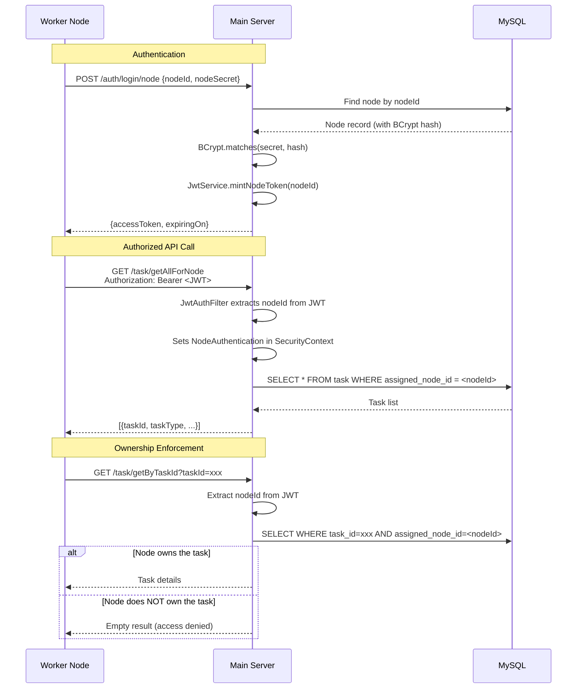
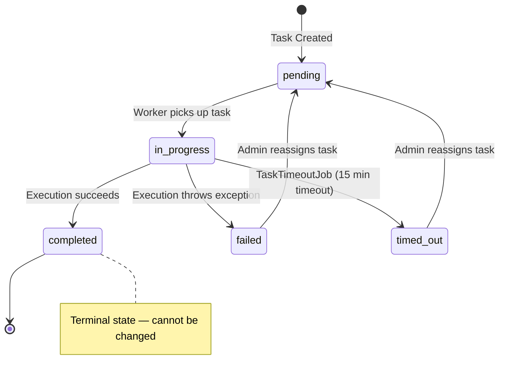
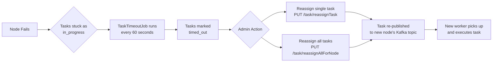
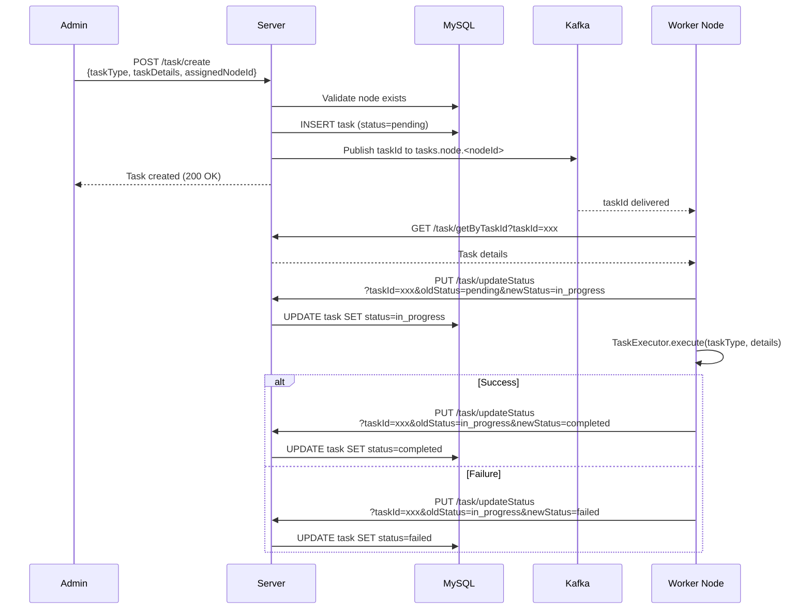

# Architecture Overview — Node-Assigned Distributed Task System

## High-Level System Diagram

---

## Components

### 1. Main Server (`server/`)

| Component | Class | Responsibility |
|---|---|---|
| **Auth Controller** | `AuthController` | User login (`/auth/login`) and node login (`/auth/login/node`) |
| **Task Controller** | `TaskController` | CRUD + status update + reassignment APIs under `/task/**` |
| **Task Service** | `TaskService` | Business logic: create tasks, ownership-scoped fetch, idempotent status updates, reassignment |
| **Auth Service** | `AuthService` | Validates credentials (BCrypt), mints JWT tokens via `JwtService` |
| **JWT Service** | `JwtService` | Mints & parses JWT tokens (HS256). Separate claims for `node` vs `user` types |
| **JWT Auth Filter** | `JwtAuthFilter` | Intercepts all non-auth requests, validates JWT, sets `SecurityContext` |
| **Node Authentication** | `NodeAuthentication` | Custom `Authentication` object carrying `nodeId` with `ROLE_NODE` authority |
| **Security Config** | `SecurityConfig` | Configures Spring Security: `/auth/**` open, everything else authenticated |
| **Kafka Publisher** | `KafkaPublisher` | Publishes task IDs to per-node Kafka topics (`tasks.node.<nodeId>`) |
| **Kafka Producer Config** | `KafkaProducerConfig` | Configures Kafka producer with idempotence, acks=all, retries |
| **Node Topic Provisioner** | `NodeTopicProvisioner` | On startup, creates Kafka topics for all active nodes |
| **Task Timeout Job** | `TaskTimeoutJob` | Scheduled cron (every minute): marks `in_progress` tasks as `timed_out` after 15 min |
| **Global Exception Handler** | `GlobalExceptionHandler` | Catches validation + generic exceptions, returns structured error responses |

### 2. Worker Node (`worker/`)

| Component | Class | Responsibility |
|---|---|---|
| **Task Consumer** | `TaskConsumer` | Kafka listener on `tasks.node.<nodeId>` topic; orchestrates fetch → execute → status update |
| **Task Executor** | `TaskExecutor` | Executes tasks by type: `EMAIL_SEND`, `PDF_GENERATE`, `DATA_EXPORT`, `REPORT_BUILD` |
| **Server API Client** | `ServerApiClient` | REST client to call server APIs with automatic JWT retry on 401 |
| **Token Manager** | `TokenManager` | Manages JWT lifecycle: login, cache token, auto-refresh before expiry |
| **Kafka Consumer Config** | `KafkaConsumerConfig` | Configures Kafka consumer with per-node group ID and topic binding |

### 3. MySQL Database (`node_tasks`)

Three tables: `node`, `task`, `user` — see [`schema.sql`](schema.sql) for DDL.

### 4. Apache Kafka

- **One topic per node**: `tasks.node.1`, `tasks.node.2`, etc.
- Topics are auto-created on server startup by `NodeTopicProvisioner`
- Each worker consumes only from its own topic
- Producer configured with `acks=all`, idempotence enabled, 5 retries

---

## Security Flow

---

## Task Lifecycle — State Machine

### Status Transition Rules

| From | Allowed To | Blocked |
|---|---|---|
| `pending` | `in_progress` | — |
| `in_progress` | `completed`, `failed` | `pending` |
| `completed` | **NONE** (terminal) | All transitions blocked |
| `failed` | `pending` (via reassign) | — |
| `timed_out` | `pending` (via reassign) | — |

---

## Failover & Recovery

### Key Points

1. **Tasks remain locked**: When a node fails, its tasks stay assigned to it (no automatic steal).
2. **Timeout detection**: `TaskTimeoutJob` runs every minute. If an `in_progress` task hasn't been updated in 15 minutes (`app.task.timeoutSeconds=900`), it's marked `timed_out`.
3. **Manual/Admin reassignment**: Admin user can reassign a single task or all non-completed tasks of a node to a different node.
4. **Kafka re-notification**: On reassignment, the task ID is re-published to the new node's Kafka topic, so the new worker picks it up automatically.

---

## Data Flow — Task Creation to Completion

